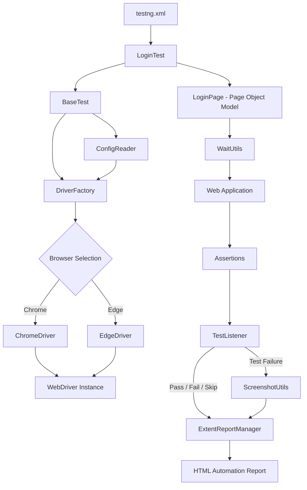
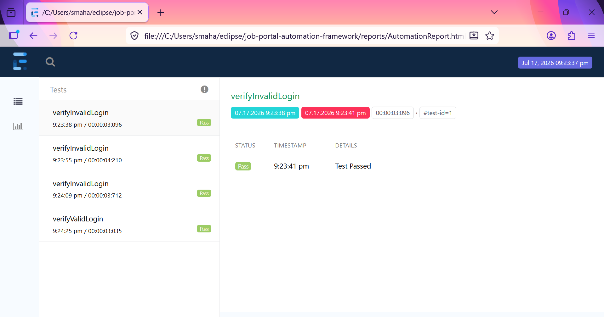
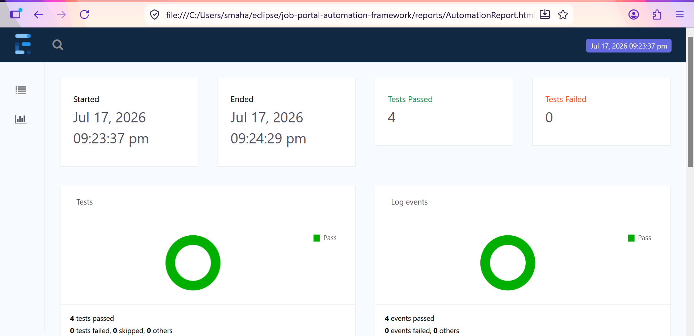
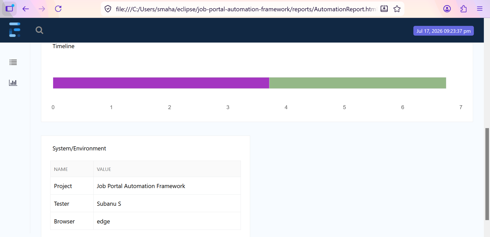
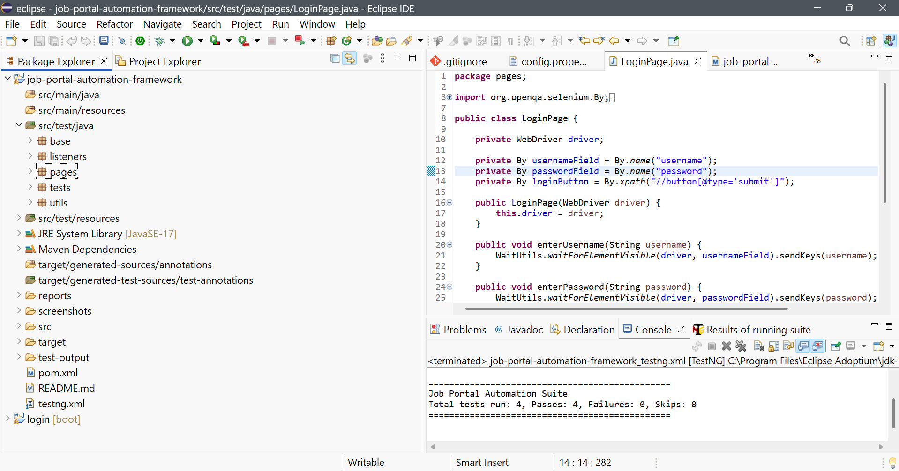

# Smart Web Automation Testing Framework

## Overview

A robust Selenium Test Automation Framework developed using Java, TestNG, Maven, and the Page Object Model (POM). The framework is designed to provide reusable, maintainable, and scalable web application testing with support for configuration management, cross-browser execution, reporting, screenshots, and data-driven testing.

---

## Features

- Page Object Model (POM)
- Cross Browser Testing (Chrome & Edge)
- DriverFactory for centralized browser management
- ConfigReader for external configuration
- Explicit Wait Utility
- Screenshot Capture on Test Failure
- TestNG Listeners
- Extent Reports
- Data Driven Testing using TestNG DataProvider
- Maven Project Structure
- Git & GitHub Version Control

---

## Technology Stack

- Java 17
- Selenium WebDriver
- TestNG
- Maven
- Extent Reports
- Git
- GitHub

---

## Framework Structure

```
src
 ├── test
 │    ├── java
 │    │     ├── base
 │    │     ├── listeners
 │    │     ├── pages
 │    │     ├── tests
 │    │     └── utils
 │    │
 │    └── resources
 │          └── config
```

---
## Framework Architecture


---

# Extent Report 1



---

# Extent Report 2



---

# Extent Report 3




# Project Structure

The framework follows a modular and reusable architecture with separate packages for base classes, page objects, utilities, listeners, test cases, and configuration.


---
## Framework Flow

```
testng.xml
      ↓
LoginTest
      ↓
BaseTest
      ↓
DriverFactory
      ↓
ConfigReader
      ↓
Chrome / Edge Driver
      ↓
LoginPage
      ↓
WaitUtils
      ↓
Assertions
      ↓
TestListener
      ↓
Screenshot
      ↓
Extent Report
```

---

## Current Test Scenarios

### Positive Test

- Valid Login

### Negative Tests

- Invalid Password
- Invalid Username
- Invalid Username & Password

---

## Cross Browser Support

Supported Browsers

- Chrome
- Microsoft Edge

Browser selection is controlled through:

```
config.properties
```

Example

```properties
browser=chrome
```

or

```properties
browser=edge
```

---

## Reporting

- Extent HTML Report
- Screenshot on Failure
- TestNG Execution Report

---

## Future Enhancements

- Excel Driven Testing (Apache POI)
- Retry Analyzer
- Jenkins CI/CD
- Docker Execution
- Selenium Grid